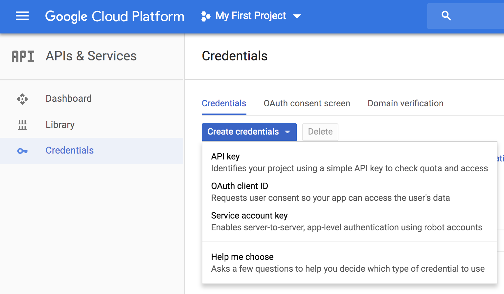

# Google Vision API
*Made easy! Cloud Vision API enables developers to understand the content of an image by encapsulating powerful machine learning models in an easy-to-use REST API. It quickly classifies images into thousands of categories (such as, “sailboat”), detects individual objects and faces within images, and reads printed words contained within images.*

<p align="center">
  
</p>

## Get started in 2 min!

### Get the API key

- Browse here: [https://cloud.google.com/vision/](https://cloud.google.com/vision/)
- Create a Google account. You might be lucky and get $300 of free usage.
- Activate the Vision API with the free trial.
- Browse here: [https://console.cloud.google.com/apis/credentials](https://console.cloud.google.com/apis/credentials)
- Go to credentials tab and create a new one (cf. screenshot below). **Create Credentials > API Key**.

<p align="center">
  
</p>


### Run those commands to install the lib

```bash
git clone git@github.com:philipperemy/vision-api.git && cd vision-api
virtualenv -p python3 venv
source venv/bin/activate
pip install -r requirements.txt
```

## Inference

Let's run one inference on a cat's picture:


<p align="center">
  
</p>

### Command

```
export GOOGLE_API_KEY=<API_KEY>; python vision.py images/cat.jpg
```

### Output

You should get something like:

<details>
 <summary>Show details</summary>

```
{
    "responses": [
        {
            "labelAnnotations": [
                {
                    "mid": "/m/01yrx",
                    "description": "cat",
                    "score": 0.99459696,
                    "topicality": 0.99459696
                },
                {
                    "mid": "/m/01l7qd",
                    "description": "whiskers",
                    "score": 0.9477582,
                    "topicality": 0.9477582
                },
                {
                    "mid": "/m/04rky",
                    "description": "mammal",
                    "score": 0.92298394,
                    "topicality": 0.92298394
                },
                {
                    "mid": "/m/07k6w8",
                    "description": "small to medium sized cats",
                    "score": 0.9217613,
                    "topicality": 0.9217613
                },
                {
                    "mid": "/m/0307l",
                    "description": "cat like mammal",
                    "score": 0.89394915,
                    "topicality": 0.89394915
                },
                {
                    "mid": "/m/035qhg",
                    "description": "fauna",
                    "score": 0.89245945,
                    "topicality": 0.89245945
                },
                {
                    "mid": "/m/012c9l",
                    "description": "domestic short haired cat",
                    "score": 0.777281,
                    "topicality": 0.777281
                },
                {
                    "mid": "/m/014sv8",
                    "description": "eye",
                    "score": 0.7664183,
                    "topicality": 0.7664183
                },
                {
                    "mid": "/m/05mqq3",
                    "description": "snout",
                    "score": 0.741837,
                    "topicality": 0.741837
                },
                {
                    "mid": "/m/0cnmr",
                    "description": "fur",
                    "score": 0.6560444,
                    "topicality": 0.6560444
                }
            ],
            "safeSearchAnnotation": {
                "adult": "VERY_UNLIKELY",
                "spoof": "UNLIKELY",
                "medical": "VERY_UNLIKELY",
                "violence": "VERY_UNLIKELY",
                "racy": "VERY_UNLIKELY"
            }
        }
    ]
}
```
</details>


## Server mode

Start the server by running this command in a terminal tab:

```bash
export GOOGLE_API_KEY=<API_KEY>; python vision_server.py
```

In another tab, run this command to query the server:

```bash
python query.py images/cat.jpg 0.0.0.0
```

The first argument is the image. The second argument is the server IP. If you run everything locally, then it's 0.0.0.0. 

You can also host the server on Amazon AWS. In that case, you will have to change the IP to the one Amazon gives you.

